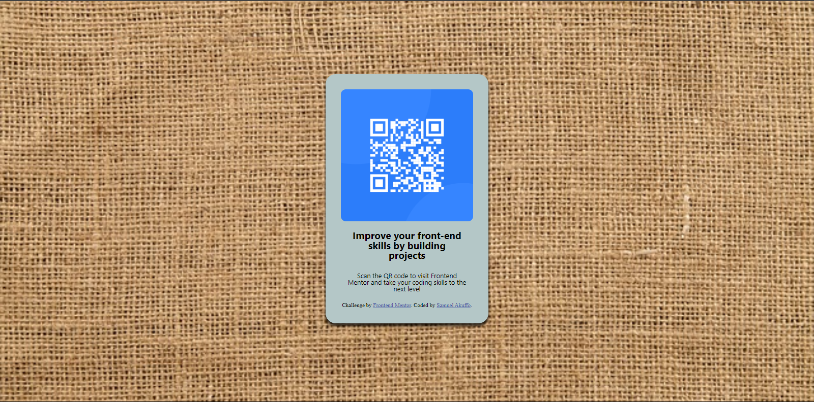

# Frontend Mentor - QR code component solution

This is a solution to the [QR code component challenge on Frontend Mentor](https://www.frontendmentor.io/challenges/qr-code-component-iux_sIO_H). Frontend Mentor challenges help you improve your coding skills by building realistic projects. 

## Table of contents

- [Overview](#overview)
  - [Screenshot](#screenshot)
  - [Links](#links)
- [My process](#my-process)
  - [Built with](#built-with)
  - [What I learned](#what-i-learned)
  - [Continued development](#continued-development)
  - [Useful resources](#useful-resources)
- [Author](#author)
- [Acknowledgments](#acknowledgments)

**Note: Delete this note and update the table of contents based on what sections you keep.**

## Overview

### Screenshot


### Links

- Solution URL: (https://github.com/KwameSA/qrcodechallenge)
- Live Site URL: (https://kwamesa.github.io/qrcodechallenge/)

## My process
I started my whole project by reading the documentation that came with the file I downloaded
I then went ahead to create my html layout of how I wanted my work to me
I update the links as needed and made use of divs to group my content
I then added appropriate classes to the divs to make my work clean and not bulky when I add my CSS
I then added a seperate CSS file when I added my classes and the styling I wanted my work to have
I made use of margins, padding, colors, flexbox and others
I decided to vamp up my work a little bit as it wasnt specified if one had to follow specific rules
And thats about it
### Built with

- Semantic HTML5 markup
- CSS custom properties
- Flexbox
- [Styled Components](https://styled-components.com/) - For styles
- [Pixabay](https://pixabay.com/images/search/texture/) - For images

### What I learned

```css
.proud-of-this-css {
 box-shadow: 0 5px 5px 0 rgba(0, 0, 0, 0.5), 0 5px 5px 0 rgba(0, 0, 0, 0.5);
}
```

### Continued development
I hope to get more comfortable with layout and the use of the flexbox

### Useful resources

(https://www.w3schools.com) - This helped me remember something about box shadowing. 

## Author

- Website - [GitHub](https://github.com/KwameSA)
- Frontend Mentor - [@KwameSA](https://www.frontendmentor.io/profile/KwameSA)
- Twitter - [@Kwame_Deezy_](https://www.twitter.com/Kwame_Deezy_)


## Acknowledgments

Thanks to me for making an effort to get better.

*
